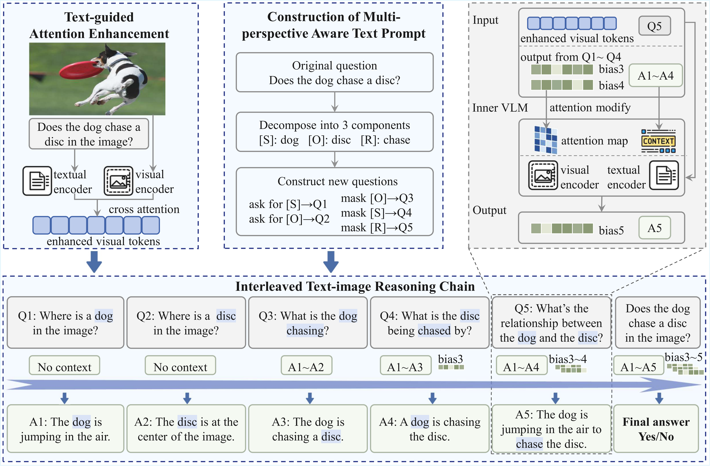

# ChainMPQ: Interleaved Text-Image Reasoning Chains for Mitigating Relation Hallucinations

[📄 arXiv]([[2510.06292\] ChainMPQ: Interleaved Text-Image Reasoning Chains for Mitigating Relation Hallucinations](https://arxiv.org/abs/2510.06292)) | [🌐 OpenReview]([ChainMPQ: Interleaved Text-Image Reasoning Chains for Mitigating Relation Hallucinations | OpenReview](https://openreview.net/forum?id=x5UMMVUfkO))

---

## Overview

ChainMPQ is a training-free framework designed to mitigate **relation hallucinations** in large vision-language models (LVLMs).

The framework consists of three key components:

1. **Text-Guided Attention Enhancement**
2. **Multi-Perspective Question Generation**
3. **Interleaved Text-Image Reasoning Chain**

ChainMPQ is model-agnostic and can be integrated with multiple LVLM backbones.

---

## Method

<p align="center">
  
</p>

ChainMPQ enhances cross-modal reasoning by:

- Extracting relational keywords from the input question
- Refining cross-attention maps via entropy-based token selection
- Performing structured multi-perspective reasoning
- Aggregating intermediate reasoning outcomes for final decision

---

## Repository Structure

```
ChainMPQ/
│
├── chainmpq/ # Core implementation
│ ├── pipeline.py
│ ├── keyword_extractor.py
│ ├── prompt_builder.py
│ └── attention_bias.py
│
├── configs/ # Model & experiment configs
├── scripts/ # Evaluation & demo scripts
├── data/ # Dataset preparation instructions
├── tools/ # Metrics & utilities
└── assets/ # Figures
```

---

## Installation

```bash
conda create -n chainmpq python=3.10
conda activate chainmpq
pip install -r requirements.txt
```

#### Download LVLM Backbones (Example: LLaVA-1.5-7B)

We use Hugging Face Hub to download model weights locally:

```bash
pip install -U huggingface-hub
huggingface-cli login   # optional if the model is public
huggingface-cli download liuhaotian/llava-v1.5-7b --local-dir llava-v1.5-7b
```

## Reproducing Results

Evaluation scripts for:

- MMRel
- R-Bench (image-level)

will be released soon.

